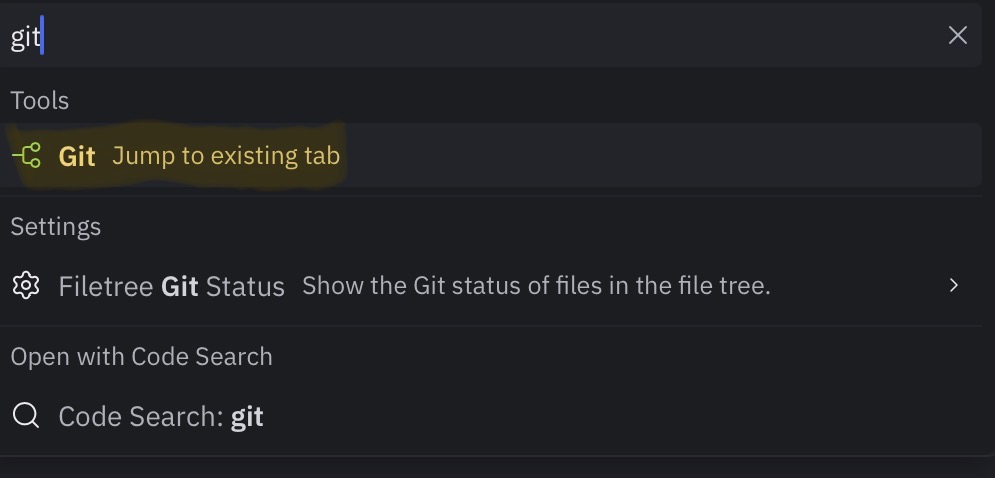
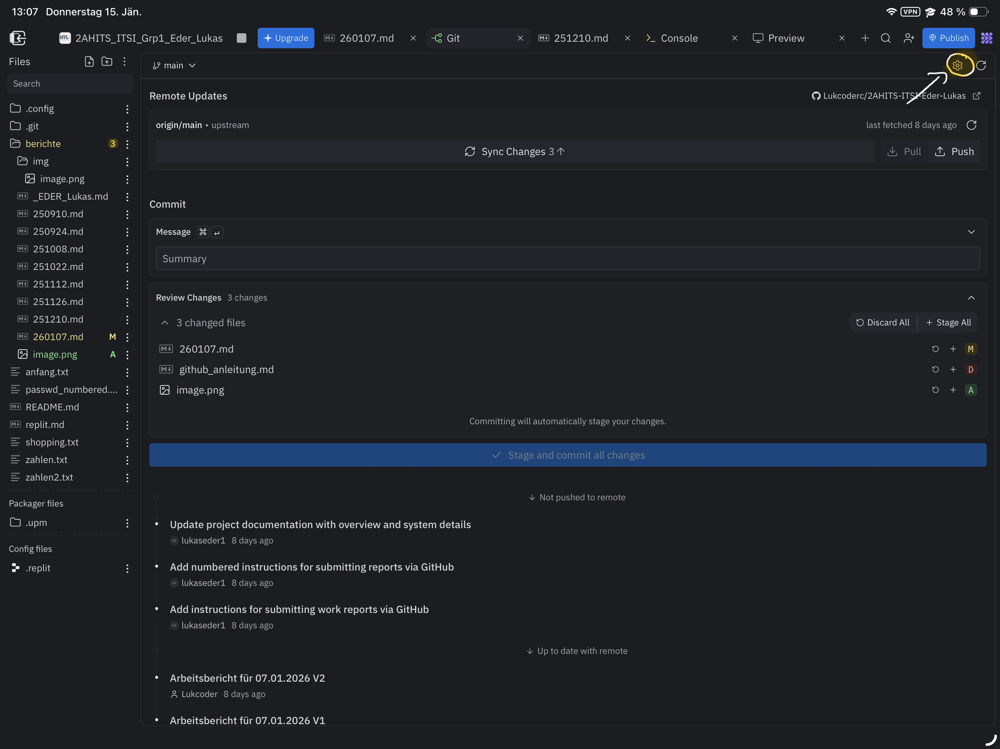
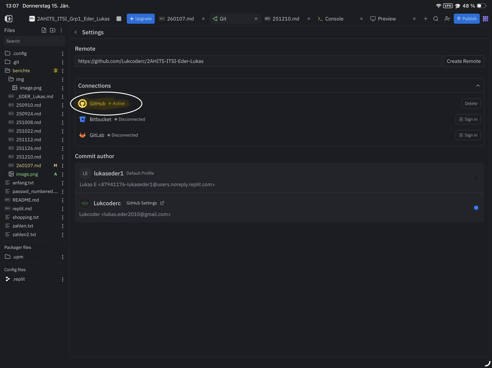
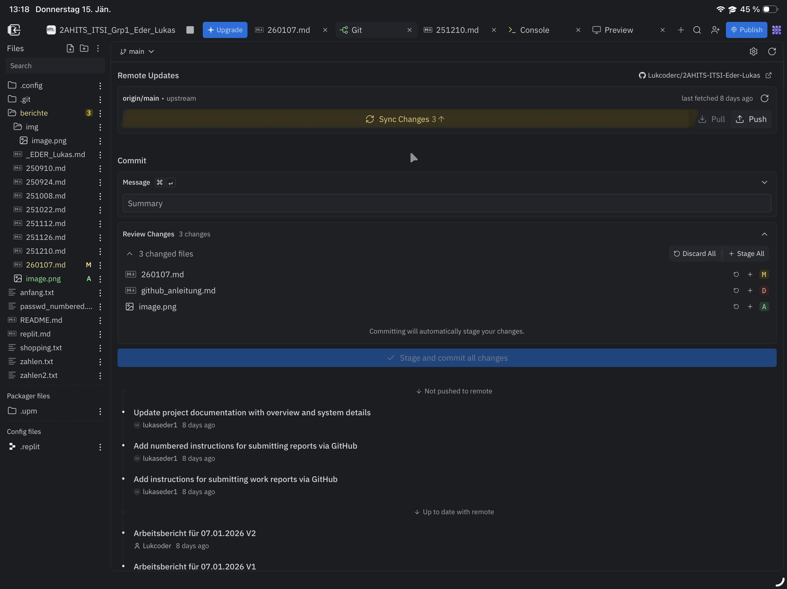
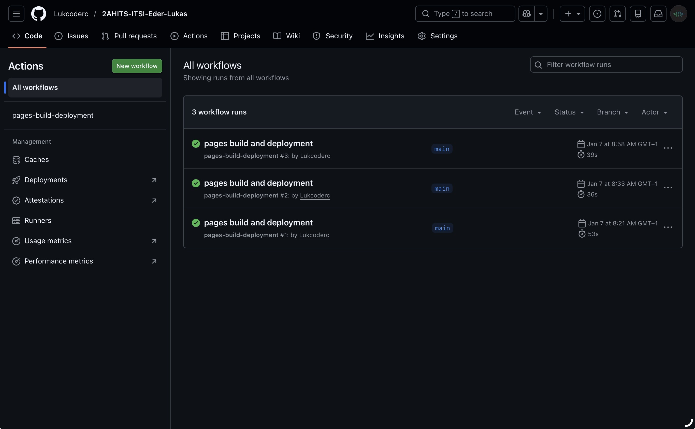
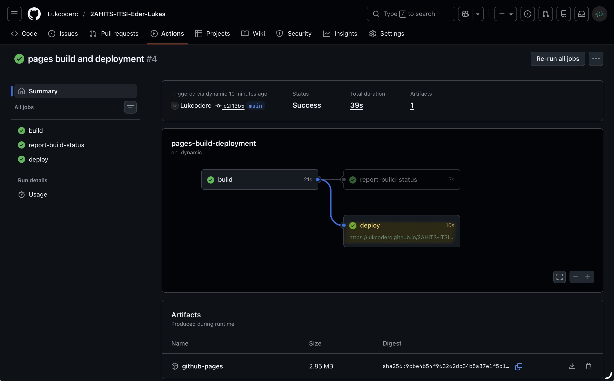

# Arbeitsbericht, 07.01.2026

- Thema: Replit x Github
- Name: Lukas Eder
- Klasse: 2AHITS Gruppe 1
- Fach: ITSI Übungen

## Neue Methode der Abgabe von Arbeitsberichtet

1. Das Replit Tool Git öffne 
2. In Git auf die Einstellungen klicken 
4. Eine Github Repository erstellen 
5. Einen Remote Zugriff zur Github Repository herstellen 
6. Änderrungen commiten und die Änderungen synchronisieren 
7. Nun sind alle Inhalte in der Repository
8. In der Repository auf den Punkt Action klicken um zu überprüfen ob alles richtig synchronisiert ist
9. Im README einen link zu dem Aktuellen Arbeitsbericht einfügen
10. In Action auf den neusten commit gehen und dort die Git-Hub pages öffnen 
11. Bei dem Link hinten den Dateipfad des Arbeitsberichtes einfügen und hinten `.html` oder gar nichts eingeben
12. Nun ist der Arbeitsbericht auf einer eigenen Website Sichtbar