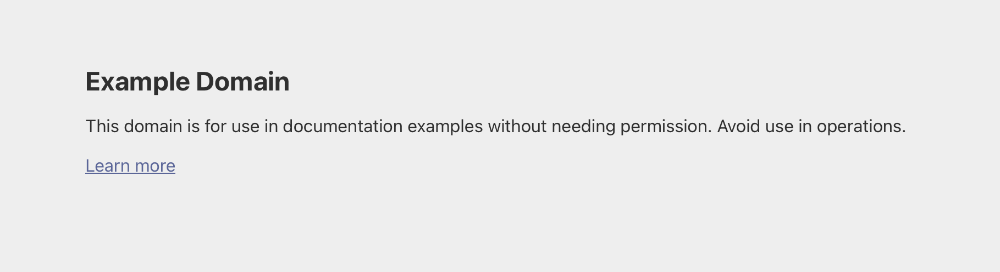

# Arbeitsbericht, 22.04.2026

- Thema: Curl
- Name: Lukas Eder
- Klasse: 2AHITS Gruppe 1
- Fach: ITSI Übungen


## Übung(curl)

`example.com`im Browser aufrufen: 


Domain mit curl in der Konsole:

```sh
curl example.com
```
Ausgabe:
```
<!doctype html><html lang="en"><head><title>Example Domain</title><meta name="viewport" content="width=device-width, initial-scale=1"><style>body{background:#eee;width:60vw;margin:15vh auto;font-family:system-ui,sans-serif}h1{font-size:1.5em}div{opacity:0.8}a:link,a:visited{color:#348}</style></head><body><div><h1>Example Domain</h1><p>This domain is for use in documentation examples without needing permission. Avoid use in operations.</p><p><a href="https://iana.org/domains/example">Learn more</a></p></div></body></html>
```


Aufgabe: Die gleiche Seite wie zuvor aufrufen, jedoch zusätzlich die HTTP-Response-Header anzeigen lassen.

Lösung:

Durch die Verwendung der Option -i werden neben dem eigentlichen Inhalt auch die Header-Informationen ausgegeben.

```sh
curl example.com -i
HTTP/1.1 200 OK
Date: Wed, 22 Apr 2026 06:33:00 GMT
Content-Type: text/html
```


Aufgabe: Eine beliebige URL im Verbose Mode mit curl aufrufen, sodass Request, Response und Header sichtbar sind.

Lösung:

Mit der Option -v können detaillierte Informationen über die Verbindung, die Anfrage und die Antwort angezeigt werden.

curl example.com -v
* Host example.com:80 was resolved.
* Connected to example.com ...
> GET / HTTP/1.1
...
< HTTP/1.1 200 OK
...

Aufgabe: Die URL https://httpbin.org/status/404
 mit curl im Verbose Mode aufrufen. Anschließend recherchieren, was der HTTP-Statuscode bedeutet und was im Browser angezeigt wird.

Lösung:

Der Statuscode 404 bedeutet, dass der Server erreichbar ist, die angeforderte Ressource jedoch nicht gefunden werden konnte.
Im Webbrowser wird in diesem Fall eine Fehlermeldung angezeigt, die darauf hinweist, dass die Seite nicht existiert.

Aufgabe: Geschlechtsschätzung anhand von Namen mithilfe der API https://api.genderize.io
 durchführen.

Lösung:

Ohne Parameter liefert die API eine Fehlermeldung:

```sh
curl https://api.genderize.io/
{"error":"Missing 'name' parameter"}
```
Mit korrekt übergebenem Parameter erhält man Ergebnisse:
```sh
curl "https://api.genderize.io/?name=Noor"
{"gender":"female","probability":0.61}
```
```sh
curl "https://api.genderize.io/?name=Ariel"
{"gender":"male","probability":0.83}
```
```sh
curl "https://api.genderize.io/?name=Amina"
{"gender":"female","probability":0.96}
```
```sh
curl "https://api.genderize.io/?name=Elowen"
{"gender":"female","probability":0.87}
```
```sh
curl "https://api.genderize.io/?name=Levin"
{"gender":"male","probability":0.96}
```

Aufgabe: Mit der Open-Meteo API aktuelle Wetterdaten für Braunau und Funchal abrufen.

Lösung:

Die API liefert strukturierte Wetterdaten im JSON-Format.

Beispiel Braunau:

```sh
curl "https://api.open-meteo.com/v1/forecast?latitude=48.25&longitude=13.04&current_weather=true"
```
Beispiel Funchal:
```sh
curl "https://api.open-meteo.com/v1/forecast?latitude=32.65&longitude=-16.91&current_weather=true"
```
Die Antworten enthalten u. a. Temperatur, Windgeschwindigkeit und Zeitstempel.

Aufgabe: JSON-Ausgaben mit dem Tool jq lesbarer formatieren.

Lösung:

Durch Weiterleiten (Pipe) der curl-Ausgabe an jq wird das JSON übersichtlich dargestellt.
```sh
curl "https://api.open-meteo.com/v1/forecast?latitude=48.25&longitude=13.04&current_weather=true" | jq
```
Dadurch wird die verschachtelte Struktur deutlich besser lesbar.

Aufgabe: Mithilfe eines Reverse-Geocoding-APIs herausfinden, zu welcher Stadt bestimmte Koordinaten gehören.

Lösung:
```sh
curl "https://api-bdc.io/data/reverse-geocode-client?latitude=35.6895&longitude=139.6917"
```
Die Antwort zeigt, dass die Koordinaten zur Stadt Tokio in Japan gehören.
